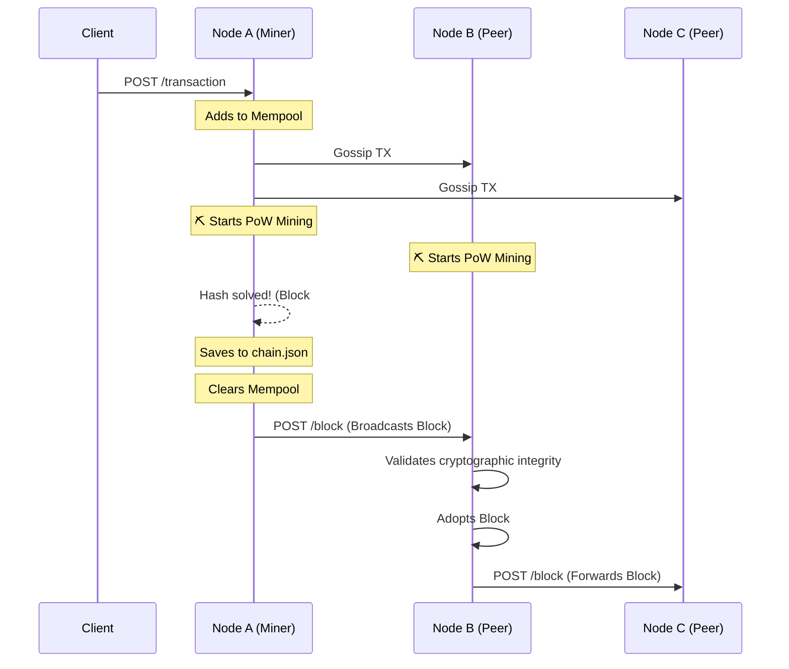

<div align="center">
  
  
  # Distributed P2P Blockchain Ledger
  
  **A production-ready, 6-node Proof-of-Work blockchain built from scratch in Go.**

  [](https://golang.org/)
  [](https://gin-gonic.com/)
  [](https://www.docker.com/)
  [](#)

  <h3>
    <a href="https://dhanunjay1729.github.io/Distributed-P2P-Ledger/">🚀 View Live Interactive Simulator</a>
  </h3>
</div>

> *Originally built as a collaborative P2P gossip ledger. Independently evolved into a full Proof-of-Work blockchain with mining, consensus, and fork resolution.*

---

## 📖 Overview

What started as a simple HTTP gossip ledger has evolved into a **fully functional, decentralized Proof-of-Work blockchain**. This project is a deep dive into distributed systems engineering, consensus algorithms, and concurrent programming in Go.

It completely mimics the foundational architecture of Bitcoin, allowing 6 isolated Docker containers to dynamically reach consensus without any central authority.

**Key Engineering Achievements:**
- 🕸️ **Decentralized Gossip Protocol:** Thread-safe network propagation utilizing a fanout strategy to broadcast data globally in logarithmic time.
- 🕒 **In-Memory Mempools:** High-throughput `sync.RWMutex` protected queues managing unconfirmed transactions.
- ⛏️ **Proof of Work (PoW) Mining:** Background worker pools grinding CPU cycles (Hashcash style) to securely append blocks to the chain.
- ⚖️ **Longest Chain Consensus (Fork Resolution):** Automatic cryptographic verification and chain-replacement when simultaneous blocks split the network.

---

## 🧠 System Architecture

The network operates as a truly peer-to-peer graph. Below is the lifecycle of a single block being mined and propagating through the system:



---

## 🛠️ The Core Engine

### 1. Gossip Engine
Nodes don't talk to everyone. They maintain a list of known peers and use a **randomized fanout algorithm** to spread transactions and blocks. This guarantees exponential propagation without flooding the network.

### 2. Transaction Mempool
When a node receives a transaction, it doesn't instantly save it. It places it in a highly-concurrent, memory-safe waiting room (`map[string]models.Transaction`) guarded by Read/Write Mutexes.

### 3. Proof of Work (Miner Worker)
An asynchronous goroutine runs perpetually on every node. If the Mempool has data, it pulls it, bundles it into a `Block`, and brute-forces a cryptographic `Nonce` until the resulting SHA-256 hash has a predetermined number of leading zeros.

### 4. Conflict Resolution (Forks)
If Node A and Node C mine Block #4 at the exact same millisecond, the network splits. The system detects this using `HandleIncomingBlock`. Nodes will query the network (`GET /chain`), verify the cryptographic signatures, and dynamically adopt the **Longest Valid Chain**, discarding their local forks to restore absolute consensus.

---

## 🚀 Quick Start (Docker)

Spin up the entire 6-node decentralized network locally using Docker Compose.

```bash
# 1. Clone the repository
git clone https://github.com/dhanunjay1729/Distributed-P2P-Ledger.git
cd Distributed-P2P-Ledger

# 2. Build and boot the 6-node cluster
make docker-run
```

Once running, you can interact with the network by sending a transaction to **Node 1**:
```bash
curl -X POST http://localhost:8081/transaction \
  -H "Content-Type: application/json" \
  -d '{"id": "tx_123", "data": "Alice sends 5 BTC to Bob", "timestamp": "2026-07-28T10:00:00Z"}'
```
*Wait 10-15 seconds for the nodes to mine the block. You can then query Node 3 to see that the network successfully achieved consensus:*
```bash
curl -X GET http://localhost:8083/chain
```

To tear down the cluster:
```bash
make docker-clean
```

---

## 📡 API Reference

Each node exposes the following RESTful interface:

| Method | Endpoint | Description |
|--------|----------|-------------|
| `POST` | `/transaction` | Submits a new transaction to the Mempool & gossips it. |
| `GET`  | `/chain` | Returns the node's entire verified cryptographic Blockchain. |
| `GET`  | `/mempool` | Returns all unconfirmed transactions currently waiting to be mined. |
| `POST` | `/block` | Network-only endpoint for receiving newly mined blocks from peers. |
| `POST` | `/gossip` | Network-only endpoint for receiving unconfirmed transactions. |
| `GET`  | `/healthz` | K8s/Docker liveness probe. |

---

<div align="center">
  <p>Built with ❤️ and <b>Go</b> by <a href="https://github.com/dhanunjay1729">Dhanunjay Reddy</a></p>
</div>
