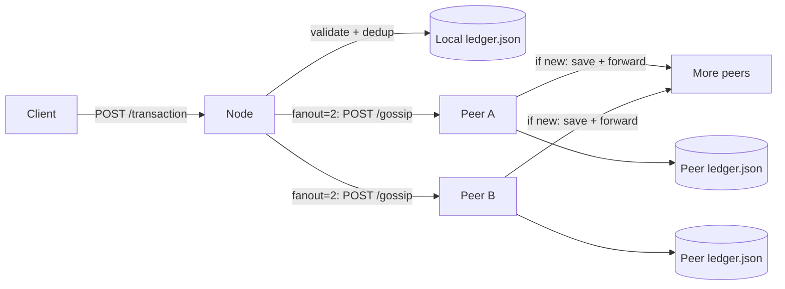

# Distributed P2P Ledger (Go)


A simplified peer-to-peer ledger built in Go that propagates transactions across nodes using HTTP gossip and persists each node’s local view to JSON storage.

---

## Overview

This project demonstrates a lightweight distributed system design:

- **Transaction API** for submitting and reading transactions
- **Gossip propagation** to spread new transactions across peers
- **Per-node persistent storage** using JSON files
- **6-node Docker Compose topology** for local multi-node simulation

> Current implementation includes **Mempool, Proof of Work Mining, Block Gossip, and Longest Chain Consensus**.
> The project has successfully evolved from a simple gossip ledger into a fully functional decentralized blockchain network!

---

## Architecture (Current)



### Runtime flow

1. Client submits transaction to `POST /transaction`
2. Node validates required fields (`id`, `data`, `timestamp`)
3. Node checks duplicate by transaction ID
4. If new, transaction is persisted locally
5. Node gossips transaction to randomly selected peers
6. Receiving peers repeat dedup + persist + forward

---

## Tech Stack

- **Language:** Go (`go 1.25.0`)
- **Module:** `p2pledger`
- **HTTP framework:** Gin (`github.com/gin-gonic/gin`)
- **Containerization:** Docker + Docker Compose
- **Storage:** File-based JSON ledger per node

---

## Repository Structure

```text
.
├── cmd/node/main.go                 # Minimal standalone net/http demo node
├── node_a/main.go                   # Main runnable P2P node used by Makefile and Docker
├── internal/
│   ├── api/                         # HTTP handlers and API tests
│   │   ├── handler.go
│   │   └── api_test.go
│   ├── models/                      # Domain models
│   │   └── transactions.go
│   └── storage/                     # Storage interface + file storage implementation + tests
│       ├── storage.go
│       ├── filestorage.go
│       └── storage_test.go
├── Gossip_Engine/gossip.go          # Gossip engine (fanout, retries, dedup, forwarding)
├── config/peers/                    # Per-node peer lists (node1.txt ... node6.txt)
├── docker-compose.yml               # 6-node local cluster (node1 ... node6)
├── Dockerfile                       # Multi-stage build for node binary
├── Makefile                         # Local run/test/docker utility commands
└── README.md
```

---

## API Endpoints

Implemented in `internal/api/handler.go`.

### 1) `POST /transaction`
Submit a new transaction.

#### Request
```bash
curl -X POST http://localhost:8081/transaction \
  -H "Content-Type: application/json" \
  -d '{"id":"tx3","data":"Alice pays Bob 10","timestamp":1730000000}'
```

#### Success responses
- `202 Accepted`
```json
{"status":"gossip_started"}
```

- `201 Created` (fallback mode when gossip engine is not configured)
```json
{"status":"saved_locally"}
```

#### Error responses
- `400 Bad Request` (invalid JSON or missing fields)
```json
{"error":"id, data, timestamp are required"}
```

- `409 Conflict` (duplicate transaction id)
```json
{"error":"already exists"}
```

---

### 2) `GET /transactions`
Returns all transactions from the node’s local ledger.

#### Request
```bash
curl http://localhost:8081/transactions
```

#### Success response
- `200 OK`
```json
[
  {
    "id": "tx3",
    "data": "Alice pays Bob 10",
    "timestamp": 1730000000
  }
]
```

---

### 3) `POST /gossip`
Peer-to-peer endpoint used internally by nodes for propagation.

#### Typical response
- `200 OK`
```json
{"status":"received"}
```

---

## Run Locally (Without Docker)

### Prerequisites

- Go 1.25+
- Make

### Run 3 local nodes

In separate terminals:

```bash
make run-node1
make run-node2
make run-node3
```

Or run them together:

```bash
make run-local-3
```

### Send a transaction

```bash
make post-tx PORT=8081 TX_ID=tx-local-1 TX_DATA="local test" TX_TS=$(date +%s)
```

### Check a node

```bash
make get-tx PORT=8081
```

### Check all expected node ports

```bash
make get-tx-all
```

---

## Run with Docker (6 Nodes)

### Start

```bash
make docker-up-d
```

(Foreground mode)

```bash
make docker-up
```

### Validate cluster

```bash
make docker-ps
```

### Smoke test

```bash
make docker-smoke
```

### Logs

```bash
make docker-logs
```

### Stop

```bash
make docker-down
```

---

## Testing

Run full test suite:

```bash
make test
```

Run specific suites:

```bash
make test-storage
make test-api
```

---

## Environment Variables

Used by `node_a/main.go` and Docker Compose:

- `PORT` — HTTP server port
- `NODE_ADDR` — node’s own base URL (used for self-filtering/logging)
- `PEERS_FILE` — path to peer list file
- `LEDGER_FILE` — path to JSON ledger file

---

## Troubleshooting

### 1) `connection refused` on curl
- Ensure the node is running (`make run-node1` or `make docker-up-d`)
- Verify you are hitting the correct port (`8081`���`8086` in this repo)

### 2) Docker nodes start but no gossip spread
- Check peer files under `config/peers/`
- Confirm `NODE_ADDR` and `PEERS_FILE` are correctly mounted in compose
- Inspect logs with `make docker-logs`

### 3) Duplicate transaction errors
- This is expected for repeated IDs; transaction IDs are deduplicated
- Use a new `TX_ID` each time when testing

### 4) Empty transaction list
- Query the same node where you posted first, then wait briefly for gossip propagation
- Use `make get-tx-all` to inspect all nodes

---

## Current State vs Roadmap

### Implemented now
- Transaction validation API
- Local JSON persistence
- Transaction deduplication by ID
- Random peer fanout gossip with retry/backoff
- Multi-node local deployment with Docker Compose

### Planned next
- Block model (`Index`, `PreviousHash`, `CurrentHash`)
- Block acceptance/validation rules
- Fork detection + chain sync endpoint
- Longest-chain conflict resolution
- Deterministic integration tests for conflict scenarios

---

## Suggested Next Steps for Contributors

1. Unify runtime entrypoint (`cmd/node` and `node_a`) into a single production path
2. Add metrics/health endpoints (`/healthz`, gossip counters)
3. Add idempotency tests for gossip storms
4. Add fault-injection tests (peer timeout, partial network)
5. Add CI workflow for `make test` and lint
